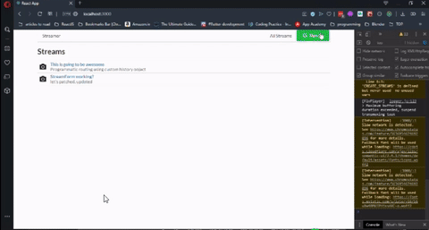

## Streaming App

## Packages and services used.

- Used of axios for fetching data from json server
- Redux for state management
- semantic ui for styling the app
- redux form for managing user inputed data
- node media server for fetching video stream from rtmp OBS stream
- json server for storing data
- google auth for login
- react-router-dom for routing
- flv.js for rendering video stream

## Screen Capture

